# Security of Information and Organizations - Project 1

## 2022/2023

### Professors

- Professor [André Ventura da Cruz Marnoto Zúquete](https://www.ua.pt/pt/p/10320078)
- Professor [Alfredo Miguel Melo Matos](https://www.ua.pt/pt/p/80650877)

### Department

- Departamento de Eletrónica, Telecomunicações e Informática

### Team Members (DETI Memorabilia)

- Hugo Correia(ID: 108215)
- Bernardo Figueiredo (ID: 108073)
- Joaquim Rosa (ID: 109089)
- Alexandre Cotorobai (ID: 107849)

### Contribution

All students contributed equally to the project.

### Index

- [Introduction](#introduction)
- [System Description](#system-description)
- [Explored Vulnerabilities](#explored-vulnerabilities)
  - [CWE - 89](#cwe---89-improper-neutralization-of-special-elements-used-in-an-sql-command-sql-injection)
  - [CWE - 79](#cwe---79-improper-neutralization-of-input-during-web-page-generation-cross-site-scripting)
  - [CWE - 352](#cwe---352-cross-site-request-forgery-csrf)
  - [CWE - 522](#cwe---522-insufficiently-protected-credentials)
  - [CWE - 200](#cwe---200-exposure-of-sensitive-information-to-an-unauthorized-actor)
  - [CWE - 20](#cwe---20-improper-input-validation)
  - [CWE - 311](#cwe---311-missing-encryption-of-sensitive-data-cwe---256-plaintext-storage-of-a-password-cwe---257-storing-passwords-in-a-recoverable-format)
  - [CWE - 256](#cwe---311-missing-encryption-of-sensitive-data-cwe---256-plaintext-storage-of-a-password-cwe---257-storing-passwords-in-a-recoverable-format)
  - [CWE - 257](#cwe---311-missing-encryption-of-sensitive-data-cwe---256-plaintext-storage-of-a-password-cwe---257-storing-passwords-in-a-recoverable-format)
  - [CWE - 521](#cwe---521-weak-password-requirements)
  - [CWE - 620](#cwe---620-unverified-password-change)
  - [CWE - 434](#cwe---434-unrestricted-upload-of-file-with-dangerous-type)
- [Conclusion](#conclusion)
- [References](#references)

## Introduction

This project was developed in the context of the curricular unit of Security of Information and Organizations (SIO), of the Degree in Informatics Engineering (LEI), at the University of Aveiro (UA). The main objective of this project is the implementation of an information system that allows the management of an online store for merchandising products from the Department of Electronics, Telecommunications and Informatics (DETI) of the University of Aveiro (UA). This report will present the details of the system implementation, as well as the vulnerabilities exploited and the measures taken to correct them.

## System Description

### System and Project Structure

Our system consists of 3 main components:

1. **Web Application**: Allows users to access the system through a web browser.

2. **Database**: Stores all information related to users, products, orders, etc.

3. **Server**: Responsible for processing user requests and communicating with the database.

Using the system, users can register, authenticate, browse available products, add products to the shopping cart, place orders, check order history, and more.

### Technologies Used

In terms of technologies, our web application was developed using the [Flask](https://flask.palletsprojects.com/en/2.0.x/) framework, which is a minimalist web framework for Python. The database was implemented using [SQLite](https://www.sqlite.org/index.html), which is a relational database management system (Back-end). For the front-end, we used HTML, CSS, and JavaScript to develop the graphical interface of the web application. The entire project is contained within a [Docker-Compose](https://docs.docker.com/compose/) setup, which allows for the simple and quick execution of all system components.

### Directory Structure

The project directory structure is as follows:

```
.
├── analysis
│   ├── relatório.md
│   └── relatório.pdf
├── app
│   ├── api
│   │   ├── templates
|   |   |   ├── index.html
|   |   |   └──  etc...
│   │   ├──static
│   │   |   ├── css
|   |   |   |   ├── style.css
|   |   |   |   └── etc...
│   │   |   ├── js
|   |   |   |   ├── script.js
|   |   |   |   └── etc...
│   │   ├── app.py
│   │   ├── models.py
│   │   └──  etc...
│   ├── Dockerfile
│   ├── Poetry.lock
│   ├── pyproject.toml
│   └── etc...
├── app_sec
│   └──  same as app
├── docker-compose.yml
├── README.md
└── etc...
```

## Explored Vulnerabilities

### CWE - 89: Improper Neutralization of Special Elements used in an SQL Command ('SQL Injection')

#### Abstract

SQL injection is a type of cyber attack in which an attacker manipulates an application's input fields to inject malicious SQL (Structured Query Language) code into the database.

This allows the attacker to gain unauthorized access, retrieve, modify, or delete data, and potentially take control of the database.

SQL injection occurs when an application does not properly validate or sanitize user inputs, making it vulnerable to malicious SQL commands that are executed by the database.

#### Exploitation

In the insecure version of our web application, it's possible to use SQL injection to gain access to a registered account in the application by inserting, for example, **' or 1=1 --** into the password field.


[Video](https://media.discordapp.net/attachments/1170894914515644486/1170895061089787974/sql_injection.gif?ex=655ab400&is=65483f00&hm=846d52a6ab7f0e3d6908d2a0e6c3ca5fbdae14580de7f98ef04d9c9ac81d7d7d&)

#### Counter Measures

In the first version, the password was inserted directly into the SQL query as follows:

```python
result = session.engine.execute("Select * from users where email = '" + email + "' and password = '" + password + "'").fetchall()
```

In the secure version, there was a significant improvement in security as the code no longer constructs SQL queries directly from user inputs. Instead, it queries the database to find the user based on the provided email and checks if the entered password matches the one in the database, eliminating the possibility of SQL injection.

```python
user = local_session.query(User).filter(User.email == email).first()

if not user or not check_password_hash(user.password, password):
    flash("Please check your login details and try again.")
    return redirect(url_for("auth.login"))
```

### **CVSS**

**Base CVSS Score:** 6.5

**Vector String:** CVSS:3.1/AV:N/AC:L/PR:N/UI:N/S:U/C:L/I:L/A:N/

#### **Exploitability Metrics**

| Metric | Value | Justification                                                                                                       |
| ------ | ----- | ------------------------------------------------------------------------------------------------------------------- |
| AV     | N     | The vulnerability is exploitable from a remote network, such as the internet, without requiring user interaction.   |
| AC     | L     | The attack requires low complexity, such as the availability of an easily guessable or known SQL injection payload. |
| PR     | N     | No privileges are required to exploit the vulnerability.                                                            |
| UI     | N     | No user interaction is required to exploit the vulnerability.                                                       |
| S      | U     | The vulnerability affects the security of the entire system, not just individual resources within the system.       |

#### **Impact Metrics**

| Metric | Value | Justification                                                                                                                                            |
| ------ | ----- | -------------------------------------------------------------------------------------------------------------------------------------------------------- |
| C      | L     | The vulnerability may allow an attacker to access or modify sensitive information, but the data is typically difficult to recover or exploited.          |
| I      | L     | The vulnerability may allow an attacker to modify data, but it is unlikely to have a significant impact on the integrity of the affected system or data. |
| A      | N     | The vulnerability does not affect the availability of the affected system or data.                                                                       |

<br>

<div style="text-align:center">
  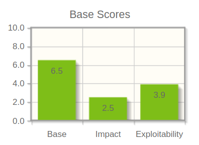
</div>

### CWE - 79: Improper Neutralization of Input During Web Page Generation ('Cross-site Scripting')

#### Abstract

Cross-Site Scripting (XSS) is a critical security vulnerability commonly found in web applications. It occurs when user inputs are not properly sanitized or neutralized before being included in web pages that are subsequently viewed by other users. Attackers can exploit this vulnerability by injecting malicious scripts, typically JavaScript, which are then executed within the context of a victim's web browser. This allows attackers to steal sensitive data, hijack user sessions, deface websites, and carry out other malicious actions that can compromise the security and integrity of web applications.

XSS vulnerabilities can manifest in various forms, including stored, reflected, DOM-based, and more, making them one of the most prevalent and harmful web application security issues.

XSS attacks can generally be categorized into two categories: reflected and stored.

- Reflected XSS (Non-Persistent XSS): In a reflected XSS attack, the malicious script is embedded in a URL or input field, typically as part of a crafted link or query parameter. When a user clicks on the manipulated link or submits a form with the malicious input, the script is immediately executed. The web application reflects the malicious payload back to the user, causing it to run in the context of the victim's browser. These attacks are typically short-lived and target a single victim at a time.

- Stored XSS (Persistent XSS): Stored XSS attacks involve permanently injecting malicious scripts into a web application, often in a database or other data storage. These scripts are then served to multiple users who access the affected page, causing the script to execute in their browsers. Stored XSS attacks have a longer-lasting impact and
  can affect many users over time.

#### Exploitation

In our unsecure version, it's possible to exploit XSS vulnerabilities by inserting malicious code into the review field of a product. This code will then be executed when the review is displayed on the product page.


[Video](https://cdn.discordapp.com/attachments/1170894914515644486/1170895058946498570/cwe-79.gif?ex=655ab400&is=65483f00&hm=a93d40ef7f158ca8581f3a8edc9427e477379ad798e78057ca7285fb13736a7c&)

#### Counter Measures

In the unsecure version of the application, the review field was not validated, allowing users to insert malicious code.

```python

@unauthenticated.route("/products/<id>", methods=["GET", "POST"])
def product(id):
    local_session = session.SessionLocal()

    if request.method == "POST":
        if current_user.is_anonymous:
            flash("Please login to leave a review.")
            return redirect(url_for("auth.login"))

        # Get form information.
        rating = request.form.get("rating")
        comment = request.form.get("comment")

        review = Review(user_id=current_user.id, product_id=id, rating=rating, comment=comment)

        local_session.add(review)
        local_session.commit()
        local_session.close()

        flash("Review added successfully.")
        return redirect(url_for("unauthenticated.product", id=id))
    else:
        product = local_session.query(Product).filter(Product.id == id).first()
        reviews = local_session.query(Review).filter(Review.product_id == id).join(User).all()
        return render_template("product.html", product=product, reviews=reviews)
```

In the secure version, the review field is sanitized to prevent malicious code from being inserted.

```python
        comment = request.form.get("comment")

        comment = comment.replace("<", "&lt;").replace(">", "&gt;").replace("&", "&amp;")
```

### *CVSS Score*

**Base CVSS Score:** 6.8

**Vector String:** CVSS:3.1/AV:N/AC:L/PR:L/UI:R/S:C/C:H/I:N/A:N

#### **Exploitability Metrics**

| Metric | Value | Justification                                                                                                                                                                |
| ------ | ----- | ---------------------------------------------------------------------------------------------------------------------------------------------------------------------------- |
| AV     | N     | The vulnerability is exploitable from a remote network. An attacker can inject malicious scripts into a web application remotely.                                            |
| AC     | L     | The attack requires low complexity, such as basic knowledge of web application behavior and crafting malicious scripts.                                                      |
| PR     | L     | The attacker needs to have basic user privileges (logged in) to exploit the vulnerability, it is necessary to be logged in to leave a review.                                |
| UI     | R     | User interaction is required to exploit the vulnerability, such as clicking on a malicious link or performing an action that triggers the execution of the malicious script. |
| S      | C     | This vulnerability affects the security of individual resources within the system, such as user sessions.                                                                    |

#### **Impact Metrics**

| Metric | Value | Justification                                                                                                               |
| ------ | ----- | --------------------------------------------------------------------------------------------------------------------------- |
| C      | H     | The vulnerability may allow an attacker to access sensitive information, which has a significant impact on confidentiality. |
| I      | N     | The vulnerability does not allow an attacker to modify data. Even though, it can be used to steal sensitive information.    |
| A      | N     | The vulnerability does not affect the availability of the affected system or data.                                          |

<br>

<div style="text-align:center">
  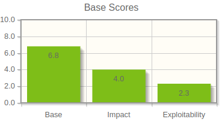
</div>

### CWE - 352: Cross-Site Request Forgery (CSRF)

#### Abstract

CWE-352, also known as Cross-Site Request Forgery (CSRF), is a security vulnerability that allows an attacker to trick an authenticated user into performing unwanted actions on a web application, without the user's knowledge or consent. This occurs when the web application does not properly verify the origin of a request, allowing unauthorised requests to be processed on behalf of the authenticated user.

#### Exploitation

To exploit this vulnerability, we created a rogue site that impersonates our website, falsely claiming to host a DETI Hoodie giveaway. When the victim clicks the 'Click here to Participate!' button, the fraudulent site uses the user's cookies to add a product to their basket without their knowledge. This is achieved by sending a POST request from the scam site to the URL responsible for adding a product to the basket.


[Video](https://cdn.discordapp.com/attachments/1170894914515644486/1170895059743420426/cwe-352.gif?ex=655ab400&is=65483f00&hm=570b08e4cfbf9bbc9989f9cd6600e4cd05acb6bfe100f8e3b4d6dce0aa711c85&)

#### Counter Measures

CORS (Cross-Origin Resource Sharing) is a security mechanism that restricts HTTP requests made from different origins. This is important to prevent unauthorised requests that can be used in security attacks such as Cross-Site Request Forgery (CSRF).

To fix this vulnerability we used Flask-CORS's CORS module and configured it so that all our website's routes could only be accessed by the URL <https://127.0.0.1:5001>, which corresponds to the URL of the website itself. As a result, requests from external websites are no longer accepted.

```python
CORS(authenticated, resources={r"/*": {"origins": "https://127.0.0.1:5001"}})
```

### **CVSS Score**

**Base CVSS Score:** 7.4

**Vector String:** CVSS:3.1/AV:N/AC:L/PR:N/UI:R/S:C/C:N/I:H/A:N

#### Exploitability Metrics

| Metric | Value | Rationale                                                                 |
| ------ | ----- | ------------------------------------------------------------------------- |
| AV     | N     | Attack is network-based.                                                  |
| AC     | L     | Attack complexity is low, requiring a crafted request.                    |
| PR     | N     | No special privileges needed; exploits the user's existing session.       |
| UI     | R     | Requires user interaction to click a malicious link.                      |
| S      | C     | Scope changes; the user's browser makes unintended cross-origin requests. |

#### Impact Metrics

| Metric | Value | Rationale                                                                                                    |
| ------ | ----- | ------------------------------------------------------------------------------------------------------------ |
| C      | N     | The vulnerability does not allow an attacker to access sensitive information or steal user data.             |
| I      | H     | Integrity impact is high as CSRF can change the state of the application, such as unauthorized transactions. |
| A      | N     | Availability is not impacted directly by CSRF.                                                               |

<br>

<div style="text-align:center">
  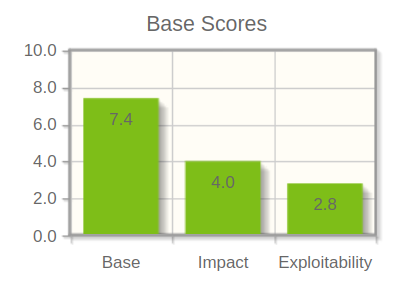
</div>

### CWE - 522: Insufficiently Protected Credentials

#### Abstract

CWE-522 refers to the scenario where a product transmits or stores authentication credentials but does so using an insecure method, making the credentials susceptible to unauthorized access. This weakness is part of a broader set of security issues that can arise when credentials are not adequately protected throughout their lifecycle in a system. More specifically, it is classified as a "Class" level weakness, which is a generalized description of a vulnerability that is not tied to any specific language or technology, and it is more abstract than "Base" level weaknesses which provide details for detection and prevention.

#### Exploitation

When a user attempts to edit their profile, they can simply change the URL to access the data of other users, including unprotected passwords and emails.


[Video](https://cdn.discordapp.com/attachments/1170894914515644486/1170895060594868275/cwe-522.gif?ex=655ab400&is=65483f00&hm=3672f4b1279955ac7c0701665406de8866af1e15dee23b2096947b0bb503e966&)

#### Counter Measures

As previously referenced, the URL contains a field relative to the user's ID, this is because the user's ID is used to access the database and retrieve the user's information. This is a major security flaw as it allows users to access other users' information by simply changing the ID in the URL.

```python
  @authenticated.route("/profile/edit/<id>", methods=["GET", "POST"])
  @login_required
  def profile_edit(id):
```

To counteract this vulnerability, it was necessary to add an additional check to ensure that the user attempting to edit their profile is the same user who is authenticated. To achieve this, an "if" statement was added to verify if the ID of the authenticated user is equal to the ID of the user attempting to edit their profile.

```python
  @authenticated.route("/profile/edit/<id>", methods=["GET", "POST"])
  @login_required
  def profile_edit(id):
    if id != str(current_user.id):
        flash("You can only edit your own profile.")
        return redirect(url_for("authenticated.profile"))
```

### **CVSS Score**

**Base CVSS Score:** 8.1

**Vector String:** CVSS:3.1/AV:N/AC:L/PR:N/UI:N/S:U/C:H/I:H/A:N

#### **Exploitability Metrics**

| Metric | Value | Justification                                                                                                                                                                                                      |
| ------ | ----- | ------------------------------------------------------------------------------------------------------------------------------------------------------------------------------------------------------------------ |
| AV     | N     | Attackers can exploit the vulnerability over the network without needing physical access to the system, as evidenced by incidents where attackers remotely access and retrieve other users' sensitive information. |
| AC     | L     | There are no special conditions required to exploit this vulnerability, making it a low-complexity attack.                                                                                                         |
| PR     | L     | The attacker needs to have basic user privileges (logged in) to exploit the vulnerability, indicating that at least some level of privileges is required.                                                          |
| UI     | N     | The vulnerability can be exploited without user intervention, such as when an attacker intercepts unencrypted credentials over a network.                                                                          |
| S      | U     | The impact is confined to the affected system and does not propagate to other systems, typical of targeted attacks on individual user accounts.                                                                    |

#### **Impact Metrics**

| Metric | Value | Justification                                                                                                                                                     |
| ------ | ----- | ----------------------------------------------------------------------------------------------------------------------------------------------------------------- |
| C      | L     | A successful attack could lead to the disclosure of all user credentials, as seen in data breaches where user databases are compromised.                          |
| I      | H     | Attackers could alter account details or privileges, reflecting the high impact on system integrity due to unprotected credentials being tampered with.           |
| A      | N     | While confidentiality and integrity are severely impacted, the system remains accessible post-exploit, which is common when credentials are extracted stealthily. |

<br>

<div style="text-align:center">
  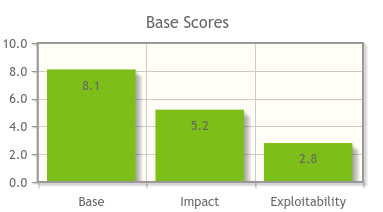
</div>

### CWE - 200: Exposure of Sensitive Information to an Unauthorized Actor

#### Abstract

The CWE-200 vulnerability pertains to situations where sensitive information is exposed to unauthorized actors or entities. This includes situations where an application, system, or service inadvertently reveals confidential or private data to individuals or systems that should not have access to it. The exposure of sensitive information can result from various flaws and weaknesses within the application's design, implementation, or configuration. Such information can encompass a wide range of data, including private/personal information, financial data, authentication credentials, and more. This vulnerability poses a significant risk to an individual's privacy and can lead to identity theft, fraud, or other malicious activities if not properly mitigated.

#### Exploitation

In this case it is possible to access other users order history by changing the id of the user in the url. This is possible because the application does not check if the user logged in is the same as the one which ID is in the url.


[Video](https://cdn.discordapp.com/attachments/1170894914515644486/1170895059361743028/cwe-200.gif?ex=655ab400&is=65483f00&hm=45320c323eb93ee14dd855999a9fcd94c72bd583f3b75041e69b0542c924e5d5&)

#### Counter Measures

This is avoided by checking if the user logged in is the same as the one which ID is in the url.

This was the original endpoint to retrive the order history of a user:

```python
@authenticated.route("/orders/<id>")
@login_required
def orders(id):
    local_session = session.SessionLocal()

    orders = local_session.query(Order).filter_by(user_id=id, is_finished=True).join(OrderItem).all()

    return render_template("orders.html", orders=orders)
```

And this is the corrected one:

```python
@authenticated.route("/orders")
@login_required
def orders():
    local_session = session.SessionLocal()

    orders = local_session.query(Order).filter_by(user_id=current_user.id, is_finished=True).join(OrderItem).all()

    return render_template("orders.html", orders=orders)
```

By using the current_user.id instead of the id from the URL and removing the latter, users are prevented from changing the ID to access other users' order histories.

### **CVSS Score**

**Base CVSS Score:** 3.5

**Vector String:** CVSS:3.1/AV:N/AC:L/PR:L/UI:R/S:U/C:L/I:N/A:N

#### **Exploitability Metrics**

| Metric | Value | Justification                                                                                                     |
| ------ | ----- | ----------------------------------------------------------------------------------------------------------------- |
| AV     | N     | The vulnerability is exploitable from a remote network, such as the internet, without requiring user interaction. |
| AC     | L     | The attack requires low complexity,as it mainly involves knowledge of basic URL syntax.                           |
| PR     | L     | Low privileges are required to exploit the vulnerability. The user only needs to be logged in                     |
| UI     | R     | User interaction is necessary to change the ID in the URL                                                         |
| S      | U     | The vulnerability affects the security of the entire system, not just individual resources within the system.     |

#### **Impact Metrics**

| Metric | Value | Justification                                                                                                                                                                  |
| ------ | ----- | ------------------------------------------------------------------------------------------------------------------------------------------------------------------------------ |
| C      | L     | The vulnerability only allow an attacker to access private information.While user order history is sensitive, it's not as critical as, for example, financial or personal data |
| I      | N     | The vulnerability does not allow an attacker to modify data.                                                                                                                   |
| A      | N     | The vulnerability does not affect the availability of the affected system or data.                                                                                             |

<br>

<div style="text-align:center">
  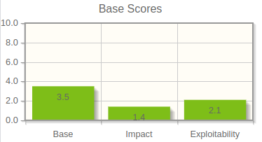
</div>

### CWE - 20: Improper Input Validation

#### Abstract

CWE-20, known as Improper Input Validation, involves a system's failure to properly ensure that all input has the necessary properties for safe processing. This vulnerability can lead to serious security issues like altered system behavior, unauthorized control over system resources, or even execution of arbitrary code. Effective input validation is critical in preventing these types of security breaches.

#### Exploitation

In the insecure version of our web application, it's possible to exploit this vulnerability by inserting negative values into the quantity field of the shopping cart. This allows the user to purchase products for free or even, in worse cases, receive money from the system.


[Video](https://cdn.discordapp.com/attachments/1170894914515644486/1170895058434797589/cwe-20.gif?ex=655ab400&is=65483f00&hm=1eb0812fe84dcc209828b32ca664dd03ed7e6b19e8c0e8012dd84ccaec9dd365&)

#### Counter Measures

In the insecure version, the quantity field was not validated, allowing users to enter negative values. In the secure version, the quantity field is validated to ensure that the value is greater than or equal to 1.

Insecure version:

```html
<td>
  <form
    action="/cart/update/{{ item.order_id }}-{{ item.product_id }}"
    method="POST"
  >
    <input type="number" name="quantity" value="{{ item.quantity }}" />
    <button type="submit">Atualizar</button>
  </form>
</td>
```

Secure version:

```html
<td>
  <form
    action="/cart/update/{{ item.order_id }}-{{ item.product_id }}"
    method="POST"
  >
    <input type="number" name="quantity" value="{{ item.quantity }}" min="1" />
    <button type="submit">Atualizar</button>
  </form>
</td>
```

By adding the min="1" attribute to the input field, the user is prevented from entering negative values.

### **CVSS Score**

**Base CVSS Score:** 5.7

**Vector String:** CVSS:3.1/AV:N/AC:L/PR:L/UI:R/S:U/C:N/I:H/A:N

#### **Exploitability Metrics**

| Metric | Value | Justification                                                                                          |
| ------ | ----- | ------------------------------------------------------------------------------------------------------ |
| AV     | N     | The vulnerability can be exploited through the network.                                                |
| AC     | L     | Attack complexity is low; no specialized access or knowledge is required.                              |
| PR     | L     | Basic user privileges are required; the attacker must be logged in to exploit the vulnerability.       |
| UI     | R     | User interaction is required to exploit the vulnerability, such as entering negative values in a form. |
| S      | U     | The vulnerability does not affect other resources; it has no scope beyond the vulnerable component.    |

#### **Impact Metrics**

| Metric | Value | Justification                                                                                        |
| ------ | ----- | ---------------------------------------------------------------------------------------------------- |
| C      | N     | There is no impact on confidentiality; the vulnerability affects the integrity of the process.       |
| I      | H     | There is a high impact on integrity as the vulnerability allows unauthorized modification of values. |
| A      | N     | There is no impact on availability; the system remains accessible after exploitation.                |

<br>

<div style="text-align:center">
  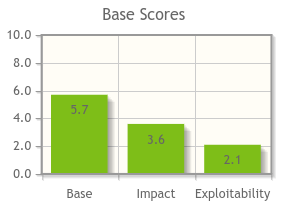
</div>

### CWE - 311: Missing Encryption of Sensitive Data; CWE - 256: Plaintext Storage of a Password; CWE - 257: Storing Passwords in a Recoverable Format

#### Abstract

This combined weakness involves the insecure handling of sensitive data, typically passwords, due to a lack of proper encryption (CWE-311), storing them in plaintext (CWE-256), or in a recoverable format (CWE-257). These vulnerabilities expose user credentials to unauthorized access and compromise confidentiality. They are related because they all deal with the improper safeguarding of passwords—CWE-311 by not encrypting data, CWE-256 by storing it visibly, and CWE-257 by allowing it to be reversed into a readable form. Effective encryption and hashing are essential to prevent these vulnerabilities and secure user data.

#### Exploitation

In the insecure version, we simply stored the passwords in the database in plain text, just as they were supplied by the users. This way, anyone with access to the database, including hackers who have managed to access it without authorization, has access to all the users' passwords.

```python
password = request.form.get("password")

#...

session.engine.execute("INSERT INTO users (first_name, last_name, email, password) VALUES ('" + first_name + "', '" + last_name + "', '" + email + "', '" + password + "')")
```

<br>

<div style="text-align:center">
  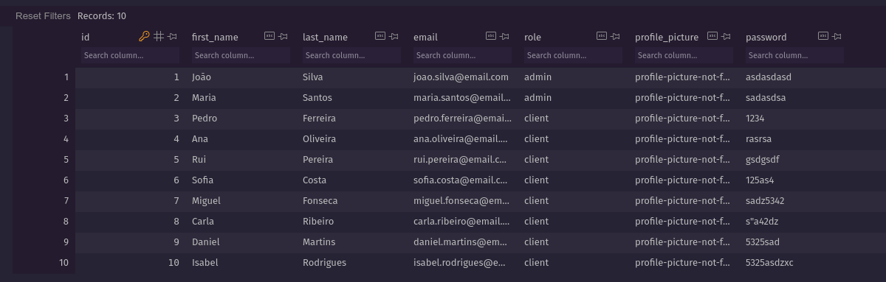
</div>

#### Counter Measures

To address this issue, we incorporated a Python library to handle the hashing of users' passwords. When a user registers on the website, a hash is generated from the provided password, and this hash is securely stored in the database to protect user's passwords.

```python
user = User(first_name=first_name, last_name=last_name, email=email, password=generate_password_hash(password))
```

<br>

<div style="text-align:center">
  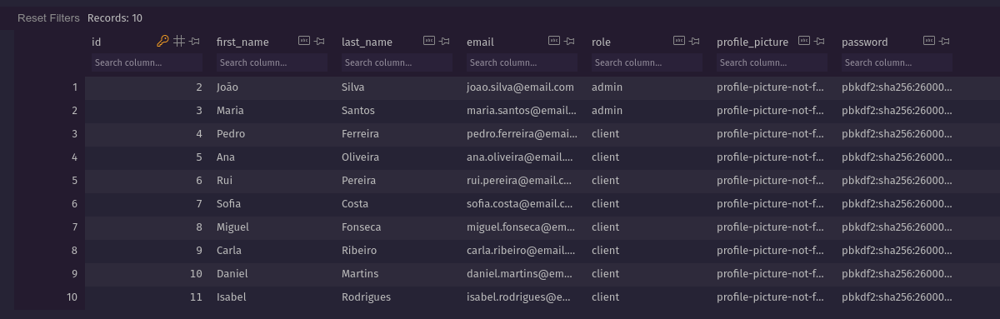
</div>

<br>

During the user login process, a method is employed to verify that the hash derived from the provided password matches the one stored in the database.

```python
if not user or not check_password_hash(user.password, password):
    flash("Please check your login details and try again.")
    return redirect(url_for("auth.login"))
```

This approach enhances the security of password storage and verification.

### **CVSS Score**

**Base CVSS Score:** 5.9

**Vector String:** CVSS:3.1/AV:N/AC:H/PR:H/UI:N/S:U/C:H/I:H/A:N

#### **Exploitability Metrics**

| Metric | Value | Justification                                                                   |
| ------ | ----- | ------------------------------------------------------------------------------- |
| AV     | N     | The vulnerability is exploitable through the network.                           |
| AC     | H     | Attack complexity is high; specialized conditions and knowledge are required.   |
| PR     | H     | High privileges are required to exploit the vulnerability.                      |
| UI     | N     | No user interaction is required for exploitation.                               |
| S      | U     | The impact is restricted to the vulnerable system without broader consequences. |

#### **Impact Metrics**

| Metric | Value | Justification                                                                                            |
| ------ | ----- | -------------------------------------------------------------------------------------------------------- |
| C      | H     | High impact due to the potential exposure of all user passwords.                                         |
| I      | H     | High impact since the attacker could use exposed passwords to impersonate users and modify account data. |
| A      | N     | No direct impact on availability; the system remains accessible.                                         |

<br>

<div style="text-align:center">
  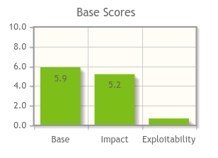
</div>

### CWE - 521: Weak Password Requirements

#### Abstract

This vulnerability occurs when the software doesn't require users to set strong passwords, which makes it easier for attackers to break into user accounts.

#### Exploitation

In the insecure version of our website, there were no password requirements, allowing users to choose any string of their choice, which could be as simple as '1234'.

```python
@auth.route("/register", methods=["GET", "POST"])
def register():
    if request.method == "POST":
        first_name = request.form.get("first_name")
        last_name = request.form.get("last_name")
        email = request.form.get("email")
        password = request.form.get("password")

        user = session.engine.execute("SELECT * FROM users WHERE email = '" + email + "'").fetchall()

        if not user:
            session.engine.execute("INSERT INTO users (first_name, last_name, email, password) VALUES ('" + first_name + "', '" + last_name + "', '" + email + "', '" + password + "')")
            flash("Account successfully created!")
            return redirect(url_for("auth.login"))
```

#### Counter Measures

In the secure version of our website we have added some requirements when creating a password:

- It cannot be less than 8 characters long;
- It must have at least one number;
- It must have at least one capital letter;
- It must have at least one lowercase letter;
- It must have at least one special character;

forcing the user to create a strong password.

```python
if len(password) < 8:
    flash("Password must be at least 8 characters")
    return redirect(url_for("auth.register"))
elif not any(char.isdigit() for char in password):
    flash("Password must contain at least 1 number")
    return redirect(url_for("auth.register"))
elif not any(char.isupper() for char in password):
    flash("Password must contain at least 1 uppercase letter")
    return redirect(url_for("auth.register"))
elif not any(char.islower() for char in password):
    flash("Password must contain at least 1 lowercase letter")
    return redirect(url_for("auth.register"))
elif not any(char in SpecialSym for char in password):
    flash("Password must contain at least 1 special character")
    return redirect(url_for("auth.register"))

if not user:
    user = User(first_name=first_name, last_name=last_name, email=email, password=generate_password_hash(password))
    flash("Account successfully created!")
    return redirect(url_for("auth.login"))
```

### **CVSS**

**Base CVSS Score:** 9.1

**Vector String:** CVSS:3.1/AV:N/AC:L/PR:N/UI:N/S:U/C:H/I:H/A:N

#### **Exploitability Metrics**

| Metric | Value | Justification                                                                                                                                                                                                                                                        |
| ------ | ----- | -------------------------------------------------------------------------------------------------------------------------------------------------------------------------------------------------------------------------------------------------------------------- |
| AV     | N     | The vulnerability is exploitable from a remote network, such as the internet, without requiring direct access to the target system. An attacker can leverage the vulnerability by exploiting the weak password requirements and guessing or cracking weak passwords. |
| AC     | L     | The attack requires low complexity, such as exploiting a known vulnerability in the password requirements or guessing a user's password.                                                                                                                             |
| PR     | N     | No privileges or special knowledge are required to exploit the vulnerability.                                                                                                                                                                                        |
| UI     | N     | No user interaction is required to exploit the vulnerability.                                                                                                                                                                                                        |
| S      | U     | The vulnerability affects the security of the entire system, potentially exposing all user data or the integrity of the system.                                                                                                                                      |

#### **Impact Metrics**

| Metric | Value | Justification                                                                                                                              |
| ------ | ----- | ------------------------------------------------------------------------------------------------------------------------------------------ |
| C      | H     | The vulnerability allows an attacker to access sensitive information or steal user data, such as compromising the target user's account.   |
| I      | H     | The vulnerability allows an attacker to modify data, such as changing the target user's account settings or making unauthorized purchases. |
| A      | N     | The vulnerability does not affect the availability of the affected system or data, but it still poses a serious security risk.             |

<br>

<div style="text-align:center">
  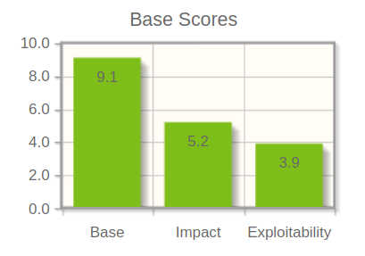
</div>

### CWE - 620: Unverified Password Change

#### Abstract

When setting a new password for a user, the product does not require knowledge of the original password, or using another form of authentication.

This could be used by an attacker to change passwords for another user, thus gaining the privileges associated with that user.

#### Exploitation

In the first version of our website, when the user wanted to change their current password, they just entered their new password in the "Password" field, without having to enter their old one:

<div style="text-align:center">
  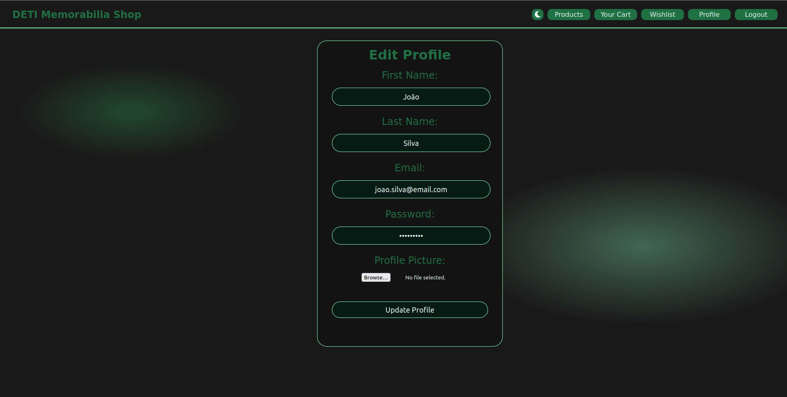
</div>

This could allow attackers with access to the user's session to change the user's password, blocking access to their own account.

#### Counter Measures

In the second version, two fields were added: one for entering the new password and the other for confirming it. The "Password" field was now used to enter the user's current password, and the password is only changed if the current password is entered correctly.

<div style="text-align:center">
  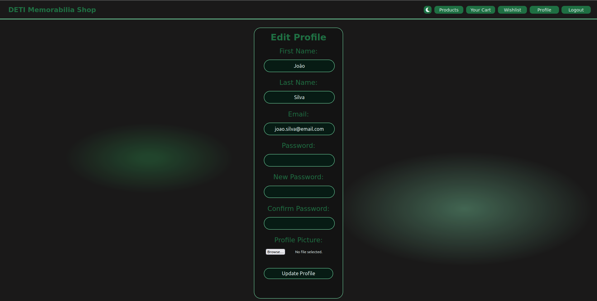
</div>

### **CVSS**

**Base CVSS Score:** 9.1

**Vector String:** CVSS:3.1/AV:N/AC:L/PR:N/UI:N/S:U/C:H/I:H/A:N

#### **Exploitability Metrics**

| Metric | Value | Justification                                                                                                                                                                                                                             |
| ------ | ----- | ----------------------------------------------------------------------------------------------------------------------------------------------------------------------------------------------------------------------------------------- |
| AV     | N     | The vulnerability is exploitable from a remote network, such as the internet, without requiring direct access to the target system. An attacker can leverage the vulnerability by exploiting a weakness in the password change mechanism. |
| AC     | L     | The attack requires low complexity, such as exploiting a known vulnerability in the password change mechanism or guessing a user's password reset token.                                                                                  |
| PR     | N     | No privileges or special knowledge are required to exploit the vulnerability.                                                                                                                                                             |
| UI     | N     | No user interaction is required to exploit the vulnerability.                                                                                                                                                                             |
| S      | U     | The vulnerability affects the security of the entire system, potentially exposing all user data or the integrity of the system.                                                                                                           |

#### **Impact Metrics**

| Metric | Value | Justification                                                                                                                                                        |
| ------ | ----- | -------------------------------------------------------------------------------------------------------------------------------------------------------------------- |
| C      | H     | The vulnerability allows an attacker to access sensitive information or steal user data, such as changing the target user's password and compromising their account. |
| I      | H     | The vulnerability allows an attacker to modify data, such as changing the target user's account settings or making unauthorized purchases.                           |
| A      | N     | The vulnerability does not affect the availability of the affected system or data, but it still poses a serious security risk.                                       |

<br>

<div style="text-align:center">
  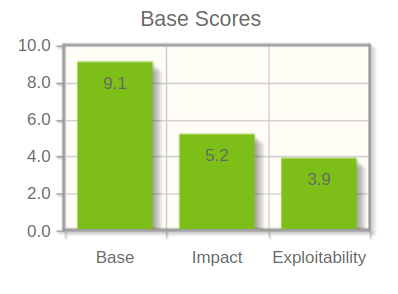
</div>

### CWE - 434: Unrestricted Upload of File with Dangerous Type

#### Abstract

CWE-434 represents a security vulnerability that arises when a web application allows users to upload files without proper validation and restrictions on file types. In this scenario, attackers can upload files containing malicious code, disguising them as legitimate files. If these malicious files are then executed within the application or downloaded by other users, they can cause a range of security issues, such as remote code execution, data breaches, or denial of service.

#### Exploitation

In this vulnerability, the attacker can upload a file without restriction in the edit profile page. This code can be executed by the application, allowing the attacker to execute malicious code in the server.


[Video](https://cdn.discordapp.com/attachments/1170894914515644486/1170895060196401243/cwe-434.gif?ex=655ab400&is=65483f00&hm=3376b864b308eefd7696468b7061194f926aa970a1d7d814e76ad1c11536695c&)

#### Counter Measures

In the secure version, the application only allows the upload of images, preventing the execution of malicious code.

```python
if profile_picture and not profile_picture.filename.endswith((".jpg", ".jpeg", ".png")):
    flash("Invalid file format.")
    return redirect(url_for("authenticated.profile_edit", id=id))
```

### **CVSS Score**

**Base CVSS Score:** 7.6

**Vector String:** CVSS:3.1/AV:N/AC:L/PR:L/UI:R/S:U/C:H/I:H/A:L

#### **Exploitability Metrics**

| Metric | Value | Justification                                                                                                                  |
| ------ | ----- | ------------------------------------------------------------------------------------------------------------------------------ |
| AV     | N     | The vulnerability is exploitable from a remote network, such as the internet, without requiring user interaction.              |
| AC     | L     | The attack requires low complexity, such as basic file upload.                                                                 |
| PR     | L     | Low privileges are required to exploit the vulnerability. The user only needs to be logged in to access the edit profile page. |
| UI     | R     | User interaction is necessary to upload the file.                                                                              |
| S      | U     | The vulnerability affects the security of the entire system, not just individual resources within the system.                  |

#### **Impact Metrics**

| Metric | Value | Justification                                                                                                                    |
| ------ | ----- | -------------------------------------------------------------------------------------------------------------------------------- |
| C      | H     | The vulnerability has a high impact on confidentiality since it allows the attacker to execute any malicious code in the server. |
| I      | H     | The vulnerability has a high impact on integrity, it can result in a total loss of integrity or a complete loss of protection.   |
| A      | L     | The vulnerability might affect the availability of the affected system depending on the malicious code executed.                 |

<br>

<div style="text-align:center">
  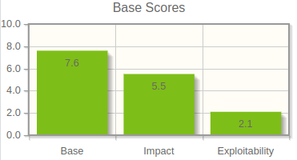
</div>

## Conclusion

This project has allowed us to apply the skills we learned in a meaningful context, which is crucial for understanding how these skills can be used in practice and implemented in a real-world scenario.
On the development of this project, our primary focus was on functionality while exploring the various vulnerabilities that can arise in the process, we kept the user interface simple and avoided unnecessary complexity.

In conclusion, this assignment has provided a comprehensive learning experience in software development and security, allowing us to apply the knowledge we have acquired until now.

### Totall CVSS Severity Score: **69,7**

## References

[Flask](https://flask.palletsprojects.com/en/2.0.x/) - The web framework used

[Jinja2](https://jinja.palletsprojects.com/en/3.0.x/) - The template engine used

[SQLAlchemy](https://www.sqlalchemy.org/) - The ORM used

[Sqlite](https://www.sqlite.org/index.html) - The database used

[CWE](https://cwe.mitre.org/index.html) - Common Weakness Enumeration

[CVSS](https://nvd.nist.gov/vuln-metrics/cvss/v3-calculator) - Common Vulnerability Scoring System

[Flask-CORS](https://flask-cors.readthedocs.io/en/latest/) - Flask extension for handling Cross Origin Resource Sharing (CORS)

[Python](https://www.python.org/) - The programming language used

[Html](https://developer.mozilla.org/en-US/docs/Web/HTML) - The markup language used

[CSS](https://developer.mozilla.org/en-US/docs/Web/CSS) - The style sheet language used

[Docker](https://www.docker.com/) - The containerization technology used

[Docker-Compoee](https://docs.docker.com/compose/) - The tool for defining and running multi-container Docker applications
